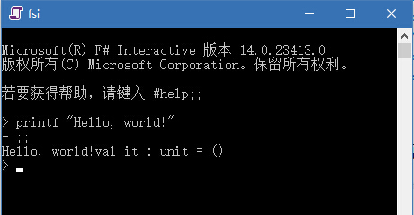

# F# 数据类型
## 简单介绍

**F#**（与C#一样，念作“F Sharp”）是一种基于.Net框架的强类型、静态类型的函数式编程语言。
可以说C#是一门包含函数式编程的面向对象编程语言，而F#是一门包含面向对象的函数式编程语言。
可以查看[官方文档](https://msdn.microsoft.com/visualfsharpdocs/conceptual/visual-fsharp)了解更多信息。

本系列文章假设你在了解C#的情况下，将F#与C#在异同点上进行说明，让读者能快速地对F#有个系统的了解。
才疏学浅，错漏难免，如果您在阅读过程中有什么建议或意见，还请不吝指教。


函数式编程这几年一直不温不火，但相信了解了F#之后，对C#也会有更深的认识，对学习其他函数式语言也会更容易上手。

## Hello, World 
在使用F#时，可以像C#一样创建一个控制台项目进行测试。
但因为F#支持以脚本形式运行，所以直接打开**F# Interactive**（以下简称fsi）进行交互是最方便的。

在Visual Studio中可在“*视图-其他窗口*”中打开。*以前没有csi的时候，一直拿fsi来测试C#代码，在VS2015中终于添加了csi。*  
如果不想打开臃肿的VS，可在Microsoft SDK的安装位置找到fsi。以下是我安装的F# 4.0的fsi的位置：
```
"C:\Program Files (x86)\Microsoft SDKs\F#\4.0\Framework\v4.0\Fsi.exe"
```

介绍任何语言的特有方式就是通过那几乎成为标准的“Hello, World”程序。  
F# 输出可使用 `printf` 函数，如下：

```F#
printf "Hello, world!"
```

当然，也可以像C#一样使用 .Net 的控制台输出函数：
```F#f
System.Console.Write("Hello World")
```
当把以上代码敲进fsi里按回车后，会发现并没反应，是因为在fsi里提交代码必须以`;;`双分号结尾。
请输入 `printf "Hello, world!";;` 和 `System.Console.Write("Hello World");;` 或者在换行后输入`;;`再次回车。
如图：


## F#基础类型

下面，我们尝试把以下简单的C#代码转换成F#代码：
```F#
int sum = 0; 
for (int i = 0; i<=100; i++) 
{     
    if (i%2 != 0)           
        sum += i; 
} 
Console.WriteLine("0到100中的奇数的和为{0}", sum);
```
这段命令式代码只是简单地把0到100中的奇数相加，并把和输出。
虽然在C#中也支持函数式，但在这里我们为了了解基本语法，使用简单语句来介绍。

以下是F#版本的代码：
```F#
let mutable sum = 0 
for i = 0 to 100 do
    if i%2 <> 0 then sum <- sum + i 
printfn "0到100中的奇数的和为%A" sum ;;
```
以上代码在fsi里的运行结果为：
> 0到100中的奇数的和为2500  
> val mutable sum : int = 2500  
> val it : unit = ()  

可以看出，F#中每行代码结尾的`;`是可选的。

因为函数式编程语言的特点之一便是无副作用（No Side Effect）、不可变（Immutable），所以没有变量（Variable）的概念，只有**值（Value）**的概念。
所以在上面的运行结果中，都是以val开头；而值`it`默认为最后一次运行结果，在此例中其类型为`unit`，相当于C#中的`void`，即无返回值。 

但是在很多场景下，Mutable（可变）可以带来很多便利，尤其是在像上面结合命令式编程的场景中。
在上面的代码中，`val mutable sum`即为一个可变的值。

### 基础类型
下面将C#和F#的数据类型定义作对比：

| 数据类型                | C#                                       | F#                                       |
| ------------------- | ---------------------------------------- | ---------------------------------------- |
| Int                 | int i = 0;                               | let i = 0 <br> let i = 0l                |
| Uint                | uint i = 1U;                             | let i = 1u <br> let i = 1ul              |
| Decimal             | decimal d = 1m;                          | let d = 1m <br> let d = 1M               |
| Short               | short c = 2;                             | let c = 2s                               |
| Long                | long l = 5L;                             | let l = 5L                               |
| unsigned short      | ushort c = 6;                            | let c = 6us                              |
| unsigned long       | ulong d = 7UL;                           | let d = 7UL                              |
| byte                | byte by = 86;                            | let by = 86y <br> let by = 0b00000101y <br> let by = ‘a’B |
| unsigned byte       | sbyte sby = 86;                          | let sby = 86uy <br> let sby = 0b00000101uy |
| bool                | bool b = true;                           | let b = true                             |
| double              | double d = 0.2;<br>  double d = 0.2d <br> double d = 2e-1 <br> double d = 2 <br> double d0 = 0 | let d = 0.2 <br> let d = 2e-1 <br> let d = 2. <br> let d0 = 0x0000000000000000LF |
| float               | float f = 0.3;<br> foat f = 0.3f;<br> float f = 2;<br>float f0 = 0.0f; | let f = 0.3f <br> let f = 0.3F<br> let f = 2.f <br> let f0 = 0x00000000lf |
| native int          | IntPtr n = new IntPtr(4);                | let n = 4n                               |
| unsigned native int | UIntPtr n = new UIntPtr(4);              | let n = 4un                              |
| char                | char c = ‘c’;                            | let c = ‘a’                              |
| string              | string str = “abc\n”;<br> string str = @"c:\filename"; | let str = “abc\n” <br> let str = @"c:\filename" |
| big int             | BigInteger i = new BigInteger(9);        | let i = 9I                               |
F#的字面量详细介绍可查看[MSDN文章](https://msdn.microsoft.com/visualfsharpdocs/conceptual/literals-%5Bfsharp%5D?f=255&MSPPError=-2147217396)。

### 十六进制、八进制和二进制
我们知道，在C#中，可以用`0x`前缀定义十六进制数值。  
而F#中除了**十六进制（`0x`）**，还可以直接定义**八进制（`0o`）和二进制（`0b`）**的数值。
```F#
let hex = 0xFABC
let oct = 0o7771L
let bin = 0b00101010y;;
```
输出结果为：
> val hex : int = 64188  
> val oct : int64 = 4089L  
> val bin : sbyte = 42y  

### 浮点数
需要注意的是，**在F#里，`double`和`float`都代表双精度浮点数**，单精度浮点数称为`float32`。

### 三重引号字符串
`String`还有一个字面量表示方法是三个双引号：
```F#
let str = """<book title="Paradise Lost">
    <content />
</book>"""
```
在使用`@`为前缀（称为Verbatim String）时，字符串内的若出现双引号必须使用两个双引号转义，使用三个双引号的表示法避免了这个问题。
这种表示法最常用在把XML文档编码到代码文件里。

### 字节数组
在类型对比表中，byte行可以看到有一个创建字节数组的语法：
```F#
let asciiBytes = "abc"B  // val asciiBytes : byte [] = [|97uy; 98uy; 99uy|]
```
其等价的C#代码是：
```F#
byte[] asciiBytes = Encoding.ASCII.GetBytes("abc");
```
当然，只支持ASCII编码。

## 变量名
F#的变量名命名规则与C#基本一致，但也可在变量名中包含单引号`'`:
```F#
let x = 10
let x' = 11
let Tom's = "2010"
```
通过`let`关键字，将`10`绑定（赋值）到`x`，将`11`绑定到`x'`。

在C#中，若要将**关键字或保留字**作为变量名，则可以变量名前加`@`实现：
例如使用代码
```c#
class @class {}
```
定义一个名为class的类。

但是在F#中，只需在前后加上` `` `即可将任意字符串指定为变量名：
```F#
let ``let`` = 4
let ``I love F#`` = "This is an F# program."
(*
    在fsi的输出结果为：
    val let : int = 4
    val ( I love F# ) : string = "This is an F# program."
*)
```
注意在F#中，单行注释和C#一样使用`//`，但**多行注释使用`(* *)`**。

F#的运算符与C#类似，部分区别将在下一篇介绍。感兴趣的可以在fsi里尝试输入运算玩一玩，或许就可以发现区别了。

*本文发表于[博客园](http://www.cnblogs.com/hjklin)。 转载请注明源链接：<http://www.cnblogs.com/hjklin/p/fs-for-cs-dev-1.html>。*
